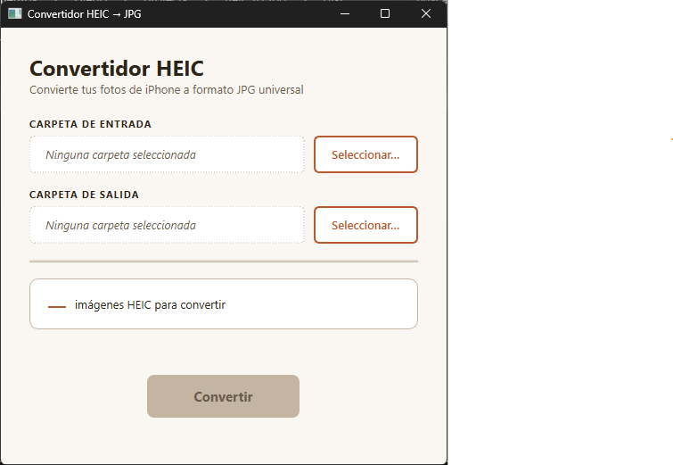

# Convertidor HEIC a JPG

Aplicación de escritorio para convertir imágenes HEIC (formato de iPhone) a JPG. Interfaz simple en español, pensada para usuarios no técnicos.



## Descarga

Descarga el ejecutable directamente desde la sección de [Releases](https://github.com/dopazo/heic-to-jpg/releases) — no requiere instalar Python ni ninguna dependencia.

## Funcionalidades

- Convierte archivos `.heic` / `.heif` a `.jpg` con calidad 95% (casi sin pérdidas, resolución original preservada). Los JPG resultantes suelen pesar más que los HEIC originales, ya que HEIC usa una compresión más eficiente que JPEG
- Procesa carpetas completas de forma recursiva, manteniendo la estructura de subcarpetas
- Copia sin modificar los archivos que no sean HEIC (otras imágenes, videos, etc.)
- Manejo de duplicados: si ya existe un archivo con el mismo nombre, agrega sufijo `_2`, `_3`, etc.
- Barra de progreso visual durante la conversión
- Muestra estadísticas de archivos antes de convertir

## Requisitos

- Python 3.13+
- [uv](https://docs.astral.sh/uv/) (gestor de paquetes)

## Instalación

```bash
uv sync
```

## Uso

```bash
uv run python main.py
```

## Generar ejecutable

```bash
uv run pyinstaller --onefile --windowed --name "Convertidor_HEIC" --clean main.py
```

El ejecutable se genera en la carpeta `dist/`, con el nombre según la plataforma:

| Plataforma | Archivo generado |
|------------|-----------------|
| Windows    | `dist/Convertidor_HEIC.exe` |
| Linux      | `dist/Convertidor_HEIC` |
| macOS      | `dist/Convertidor_HEIC` |

> En Linux, `pillow-heif` requiere `libheif` instalada en el sistema (`sudo apt install libheif1` en Ubuntu/Debian).

## Dependencias

- **PyQt6** — interfaz gráfica
- **Pillow** — procesamiento de imágenes
- **pillow-heif** — soporte para formato HEIC/HEIF
- **PyInstaller** (dev) — empaquetado a ejecutable
